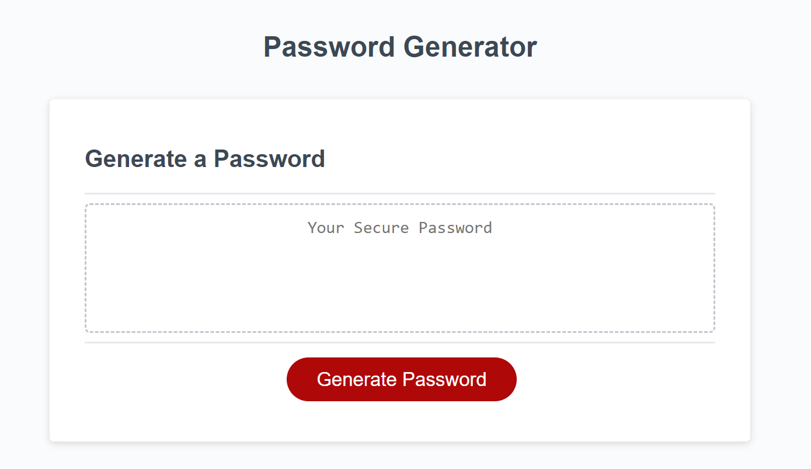

# password-generator

## Description
Challenge 3 -- JavaScript Password Generator

This project was built so that a website could help anyone randomly generate a strong new password for themselves, and have that generated password display so that it is copyable for easy use. The already-built design is also responsive to media screens for better accessibility. Throughout building this project, I learned how to translate logic into JavaScript language so that the output results in the interactivity I wished to add. I learned where it was best to use If statements, For loops, the differences between var/let/const variables, and how to tie everything inside a single function for the desired output. 

## Usage

Screenshot of deployed application:

URL of deployed application: 

https://jskelly8.github.io/password-generator/

## Credits

README template used from: https://coding-boot-camp.github.io/full-stack/github/professional-readme-guide 
	edX Boot Camps LLC. (2022, October 27). Professional readme guide. Professional README Guide | The Full-Stack Blog. https://coding-boot-camp.github.io/full-stack/github/professional-readme-guide 